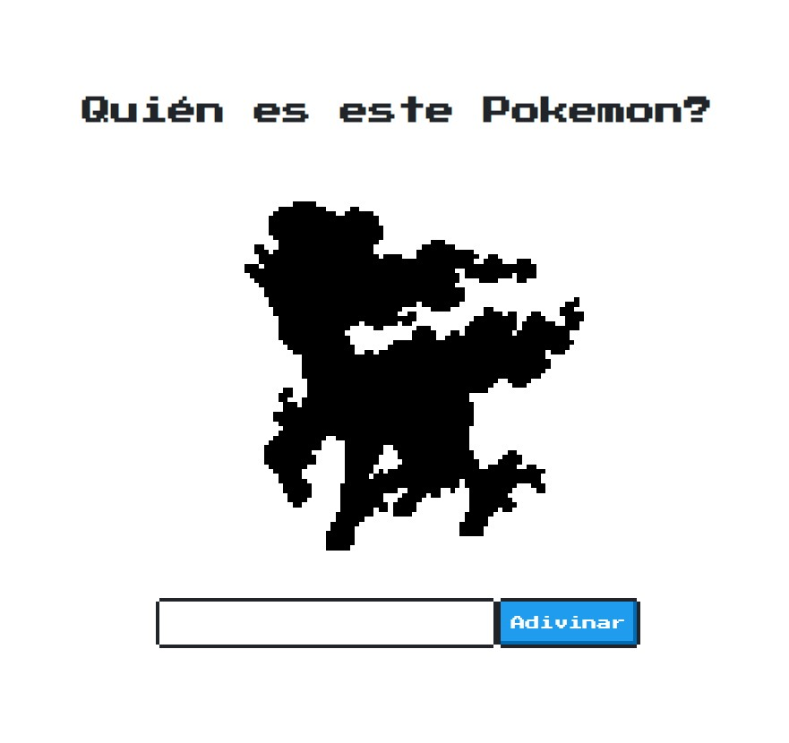

# Adivinar el Pokemon

Este proyecto tiene 3 milestones o entregas, no es necesario que cumplas todas para dar el proyecto por terminado, ajustalo a tus necesidades y conocimientos. Cada entrega se vuelve un poco más difícil.

Podés clonarlo o usarlo directamentes desde [codesandbox](https://codesandbox.io/s/github/goncy/interview-challenges/tree/main/guess-pokemon).

---

## Base
Nuestro cliente nos dio este repositorio listo para trabajar, usa la librería [NES.css](https://nostalgic-css.github.io/NES.css/) para estilos así que espera que uses los elementos provistos por la misma. También nos preparó un archivo [api.ts](./src/api.ts) con un método `random` que nos devuelve un Pokemon aleatorio para nuestra aplicación.

## Entrega 1
En esta primera entrega espera que al entrar a la página podamos ver la silueta de un Pokemon de manera aleatoria y al clickear adivinar mostremos la imágen real con el nombre del Pokemon.

> Bonus: Mejorar la interfáz de la aplicación para que sea mas linda.

## Entrega 2
En esta segunda versión debemos cumplir los siguientes puntos:

* Luego de clickear el botón adivinar debemos también indicarle al usuario si acertó o no.
* Agregar un botón de volver a jugar.
* No tomar en cuenta espacios ni mayúsculas. ej: `mrmime`, `Mr. Mime`, `Mr MiMe` son válidos.

## Entrega 3
Agregar un contador que persista luego de refrescar la página con la cantidad de aciertos y errores del usuario.

---
Si te gusta mi contenido, seguime en [Twitter](https://twitter.gonzalopozzo.com), en [Twitch](https://twitch.gonzalopozzo.com), doname un [Cafecito](https://cafecito.gonzalopozzo.com) o volvete [sponsor en github](https://github.com/sponsors/goncy) ✨
