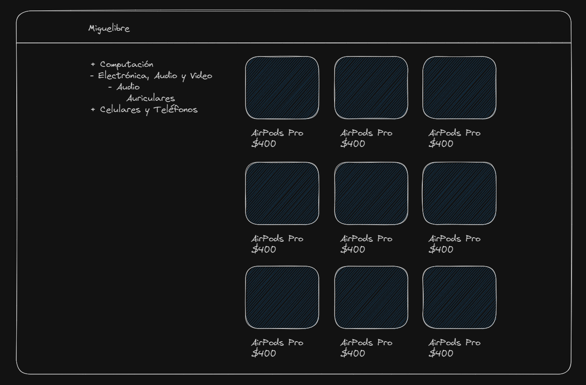

# Ejercicio de entrevista, migrado libre

Don Miguel lleva 10 años vendiendo por Mercado Libre, pero tiene un problema, el padece de [xantofobia](https://www.autopista.es/planeta2030/es-xantofobia_269191_102.html#:~:text=La%20xantofobia%20se%20refiere%20al,sea%20o%20contenga%20este%20tono.) (miedo al color amarillo), por lo que entrar a la web de Mercado Libre le produce un stress muy grande.

Su hijo Ángel, que es programador, le ha dicho que Mercado Libre tiene una API abierta que permite hacer búsquedas de productos con algunos parámetros, por ende podría crear su propia web para presentar sus productos. Pero Ángel recién está iniciando en el mundo de frontend y no sabe como hacerlo.

Ángel escuchó que Next.js, TypeScript Y Tailwindcss son buenas herramientas que podrían hacer el trabajo más fácil, así que nos dejó este proyecto preparado para que podamos ponernos a trabajar.

## Recursos

Ángel indagó un poco y descubrió que el `Seller ID` de la tienda de Miguel es `179571326`, y que la API de Mercado Libre tiene un endpoint que permite buscar productos de un vendedor en particular, el endpoint es `https://api.mercadolibre.com/sites/MLA/search?seller_id=179571326`. También nos comentó que ingresando al endpoint desde el navegador podemos ver la respuesta en formato JSON junto con algo de información. El resto de la documentación de la API está disponible en [este link](https://developers.mercadolibre.com.ar/es_ar/items-y-busquedas).

## Requerimientos

- [ ] Al entrar a la ruta `/` deberíamos ver un listado de todos los productos de Miguel en forma de grilla.
- [ ] Al entrar a la ruta `/[category_id]` deberíamos ver un listado de productos correspondientes a esa categoría.
- [ ] En todas las rutas, deberíamos ver un menú a la izquierda con las categorías disponibles. Las categorías deberían mostrarse en forma de árbol, es decir, si una categoría tiene subcategorías, deberían mostrarse como un submenú.
- [ ] Las categorías deberían iniciar contraídas, y al hacer click un botón de `-` o `+` deberían expandirse o contraerse individualmente.
- [ ] Las categorías deberían mantener su estado de expansión/contracción al navegar entre rutas.
- [ ] Al clickear una categoría, deberíamos navegar a la ruta `/[category_id]` correspondiente.
- [ ] Al clickear un producto debería redirigirnos a la web de Mercado Libre para ese producto.

## Ejemplo

> Nota: El diseño es libre, pero debería ser responsive. Dado el tiempo disponible para el ejercicio, no es necesario que sea muy complejo.
