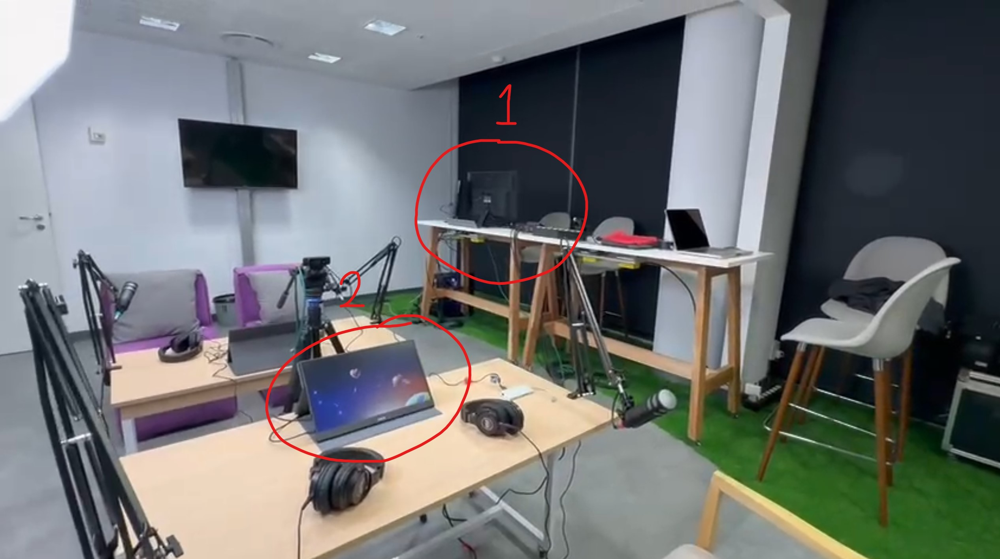
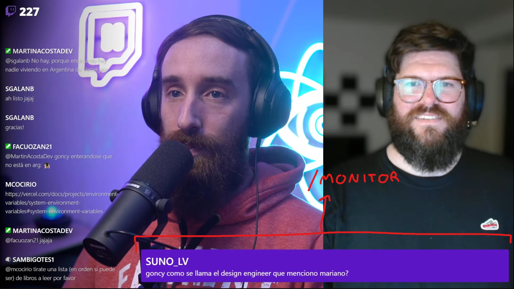
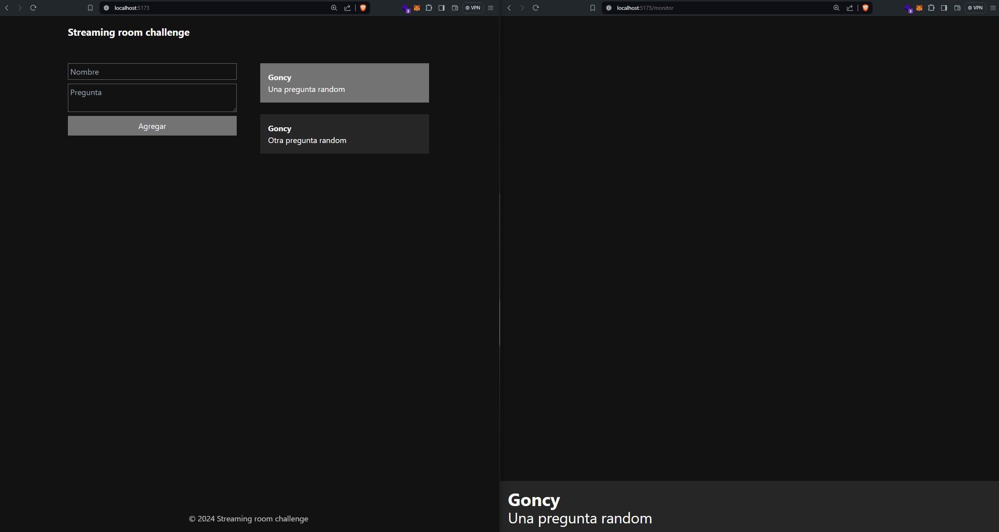

# Ejercicio de entrevista, sala de streaming

Nuestro cliente tiene un gran evento el día de hoy y se olvidó algo muy importante: Mostrar las preguntas del público en pantalla. Necesitamos una aplicación en la que el operador pueda agregar preguntas y elegir cuando mostrarlas en pantalla.

La aplicación va a ser usada por el operador en una misma PC, en dos ventanas diferentes, una en cada monitor.


> El monitor 1 sería el del operador y el monitor 2 sería el de los hosts la sala de streaming.

Un tema muy importante es que debido a un problema de conexión, nuestra aplicación no puede conectarse a internet, por lo que nuestra aplicación debe poder reflejar los cambios en tiempo real en ambas ventanas.

## Requerimientos

- [ ] Debemos mostrar en una ruta `/` un formulario para agregar preguntas con los campos `Nombre` y `Pregunta`.
- [ ] Debemos mostrar en la ruta `/` un listado de las preguntas agregadas.
- [ ] Al clickear sobre una pregunta en el listado, debemos marcarla como seleccionada.
- [ ] Al clickear sobre una pregunta seleccionada, debemos desmarcarla.
- [ ] Debemos mostrar en una ruta `/monitor` la pregunta seleccionada por el operador.
- [ ] Al no haber preguntas seleccionadas, no se debe mostrar nada.

> Es importante que la ruta `/monitor` tenga fondo transparente ya que va a ser superpuesta sobre la pantalla de los hosts 👇.


## Consideraciones

* No se evaluara el diseño de la aplicación pero cualquier mejora en la interfaz será bienvenida.
* Se tomará en cuenta la calidad del código y su presentación.
* Se evaluarán las herramientas utilizadas y los argumentos para su elección.
* Se valorará la implementación de tests, tanto unitarios como de integración, con elección de framework a elección.
* Se valorarán la adición de funcionalidades extra que mejoren el uso o experiencia de la aplicación.

## Resultado

Solo a modo ilustrativo, el resultado final podría verse algo así:


## Proyecto

Este proyecto usa React, Tailwindcss y Vite, para correr el proyecto simplemente ejecuta:

```bash
npm install
npm run dev
```

No es necesario que uses estas herramientas, en caso de usar otras simplemente agrega un README.md con las instrucciones para correr el proyecto.
